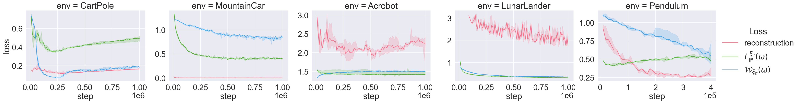
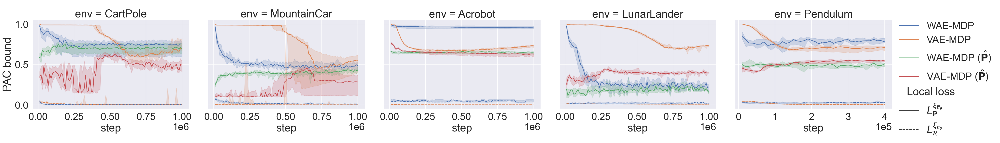
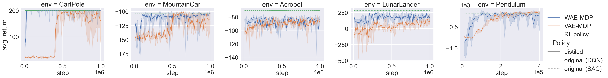

# Wasserstein Auto-encoded MDPs
### Formal Verification of Efficiently Distilled RL Policies with Many-sided Guarantees
This repository is the official implementation of the Wasserstein Auto-encoded MDP (WAE-MDP) framework, introduced in the paper [_Wasserstein Auto-encoded MDPs: Formal Verification of Efficiently Distilled RL Policies with Many-sided Guarantees_](https://openreview.net/pdf?id=JLLTtEdh1ZY) (ICLR 2023).
The implementation is a fork of the [VAE-MDP framework](https://github.com/florentdelgrange/vae_mdp).

## Installation
We provide a `conda` environment file `environment.yml` that can be used to re-create our `python` environment and reproduce our results.
The file explicitely lists all the dependencies required for running our tool.

To create the environment, run:
```shell
conda env create -f environment.yml
```

## Experiments
### Quick start
- Each individual experiment can be run via:
    ```shell
    python train.py --flagfile inputs/[name of the environment] 
    ```
- Add `--display_progressbar` to display a progressbar with useful learning metrics
- Display the possible options with `--help`
- By default,
   - the `saves` directory is created, where checkpoints and models learned are stored.
   - the `log` directory is created, where training and evaluation logs are stored.
- The logs can be vizualized via `TensorBoard` using
  ```shell
  tensorboard --logdir=log
  ```

### Evaluation
The file `evaluation.html` summarizes the results presented in our paper.
It embeds videos, comparing the performance of the input RL policies and their distillation, as well as the metrics related to the formal verification of those distilled policies.
The code for using our formal verification tool is also presented in this file.

### Reproducing the paper results
- We provide the exact hyperparameters used for each individual environment in `inputs/[name of the environment]`.
- For each environment, we provide a script (`inputs/[environment].sh`) to train 5 instances of the WAE-MDP with different seeds.
You can further run *all* the experiments as follows:
```shell
./run_all_experiments.sh
```
### Pre-trained Models
- Input RL policies are available at `reinforcement_learning/saves`.
- Pre-trained models are available at `evaluation/saved_models`.
### Results
#### WAE-MDP Losses

#### Local Losses: Pac Bounds

#### Distillation

- The code to generate the plots of the paper is availbale in the [notebook](https://jupyter.org/) `evaluation/plots.ipynb`.

## Cite
If you use this code, please cite it as:
```
@inproceedings{
delgrange2023wasserstein,
title={Wasserstein Auto-encoded {MDP}s: Formal Verification of Efficiently Distilled {RL} Policies with Many-sided Guarantees},
author={Florent Delgrange and Ann Nowe and Guillermo Perez},
booktitle={The Eleventh International Conference on Learning Representations },
year={2023},
url={https://openreview.net/forum?id=JLLTtEdh1ZY}
}
```

