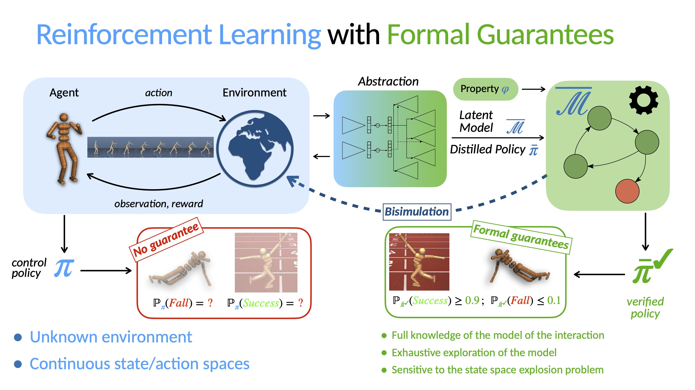

# Wasserstein Auto-encoded MDPs
### Formal Verification of Efficiently Distilled RL Policies with Many-sided Guarantees
This repository is the official implementation of the **Wasserstein Auto-encoded MDP** (**WAE-MDP**) framework, introduced in the paper [_Wasserstein Auto-encoded MDPs: Formal Verification of Efficiently Distilled RL Policies with Many-sided Guarantees_](https://openreview.net/pdf?id=JLLTtEdh1ZY) (ICLR 2023).
The implementation is a fork of the [VAE-MDP framework](https://github.com/florentdelgrange/vae_mdp).

## Summary

WAE-MDPs are generative models that allow distilling RL policies into simpler, verifiable models.
Those models are part of a general effort to provide more reliable AI agents.

Deep RL generally lacks guarantees but are very effective to solve complex tasks in intricate environments.
On the other hand, model-checking techniques allow to verify agent's policies, but need the access to an environment's model.
Since model-checking usually relies on an exhaustive exploration of the input model, the latter must in general be finite (discrete spaces) and *tractable*.

WAE-MDPs distill RL policies learned via any RL technique (in particular, through deep neural networks) to learn a discrete, latent representation of the intractable input space. The distillation yields both a simpler policy and a world model that are amenable to model-checking.

One of the main features of WAE-MDPs is that the quality of the abstraction can be formally checked through PAC bounds on *bisimulation pseudometrics*. In short, the world model is guaranteed to be bisimilarly close to the real environment; it replicates closely the agent-environment interaction behaviors through its latent space. In addition, WAE-MDPs are equipped with representation guarantees: the representation learned ensures that input states that are grouped to the same latent state are bisimilarly close (the agent behaves the same way from those states).

Beyond those PAC-verifiable guarantees, the bisimulation guarantees are also maintained during learning. 
This is in contrast to [VAE-MDPs](https://github.com/florentdelgrange/vae_mdp), which learn a surrogate, variational objective to avoid the intractable computation of the Wasserstein metric, in the fixpoint definition of bisimulation.
Instead, WAE-MDPs soundly approximate this computation by learning a discriminator ("max") that distinguishes between states that are likely to be produced in the learned world model, and those of the real environment. 
This yields a $2$-player game objective (min/max) where the goal of the minimizer is to learn both a representation and a world model that makes the latent states generated by the encoder and the world model indistinguishable.

By doing so, WAE-MDPs avoid posterior collapse issues, which drastically speeds up learning, and yield distilled policies and world models of better quality.

<p align="center">
  
</p>

## Installation
We provide a `conda` environment file `environment.yml` that can be used to re-create our `python` environment and reproduce our results.
The file explicitely lists all the dependencies required for running our tool.

To create the environment, run:
```shell
conda env create -f environment.yml
```

## Experiments
### Quick start
- Each individual experiment can be run via:
    ```shell
    python train.py --flagfile inputs/[name of the environment] 
    ```
- Add `--display_progressbar` to display a progressbar with useful learning metrics
- Display the possible options with `--help`
- By default,
   - the `saves` directory is created, where checkpoints and models learned are stored.
   - the `log` directory is created, where training and evaluation logs are stored.
- The logs can be vizualized via `TensorBoard` using
  ```shell
  tensorboard --logdir=log
  ```

### Evaluation
The file `evaluation.html` summarizes the results presented in our paper.
It embeds videos, comparing the performance of the input RL policies and their distillation, as well as the metrics related to the formal verification of those distilled policies.
The code for using our formal verification tool is also presented in this file.

### Reproducing the paper results
- We provide the exact hyperparameters used for each individual environment in `inputs/[name of the environment]`.
- For each environment, we provide a script (`inputs/[environment].sh`) to train 5 instances of the WAE-MDP with different seeds.
You can further run *all* the experiments as follows:
```shell
./run_all_experiments.sh
```
### Pre-trained Models
- Input RL policies are available at `reinforcement_learning/saves`.
- Pre-trained models are available at `evaluation/saved_models`.
### Results
#### WAE-MDP Losses

#### Local Losses: Pac Bounds

#### Distillation

- The code to generate the plots of the paper is availbale in the [notebook](https://jupyter.org/) `evaluation/plots.ipynb`.

## Cite
If you use this code, please cite it as:
```
@inproceedings{
delgrange2023wasserstein,
title={Wasserstein Auto-encoded {MDP}s: Formal Verification of Efficiently Distilled {RL} Policies with Many-sided Guarantees},
author={Florent Delgrange and Ann Nowe and Guillermo Perez},
booktitle={The Eleventh International Conference on Learning Representations },
year={2023},
url={https://openreview.net/forum?id=JLLTtEdh1ZY}
}
```

